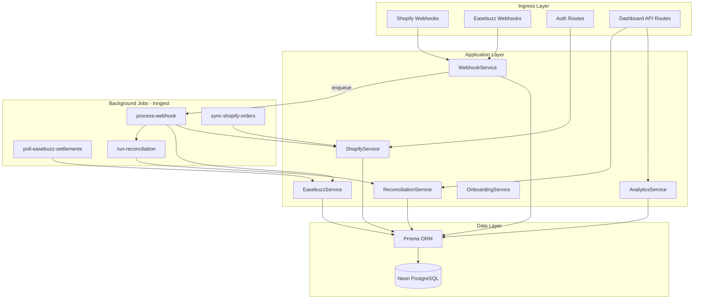
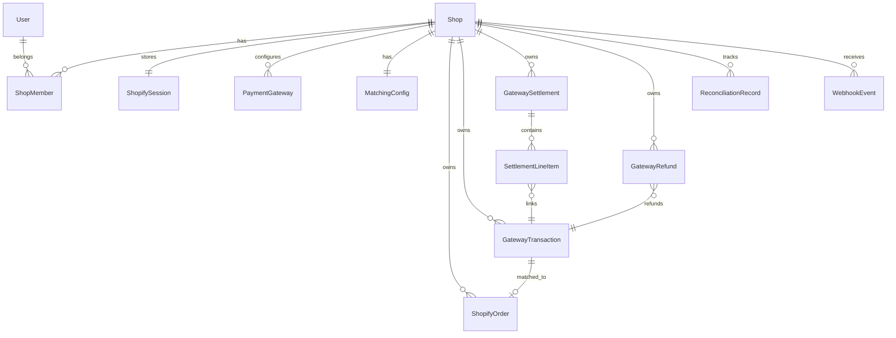
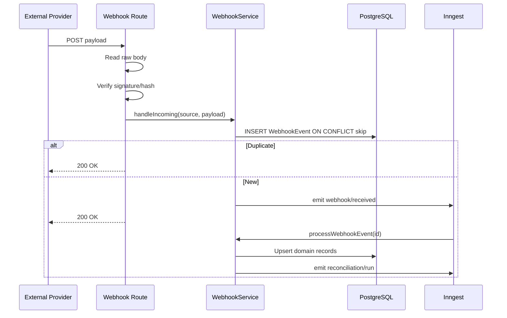
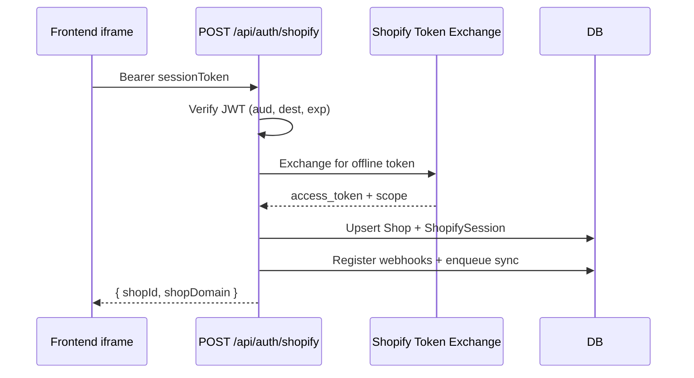
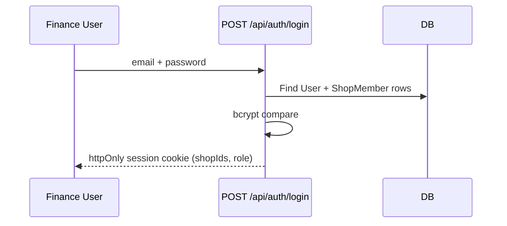
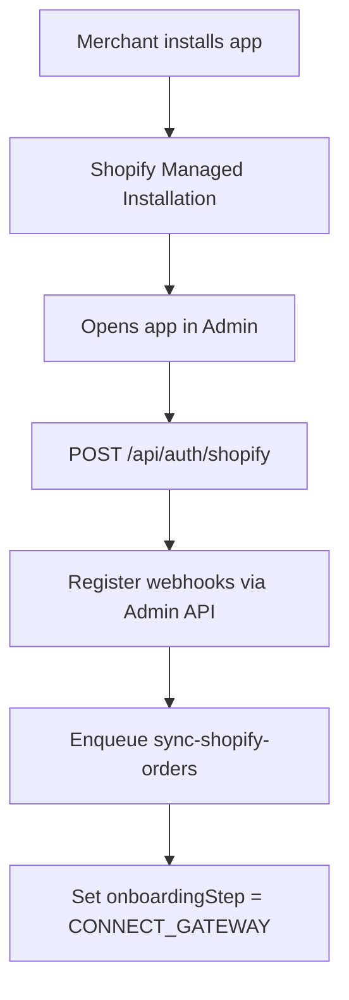
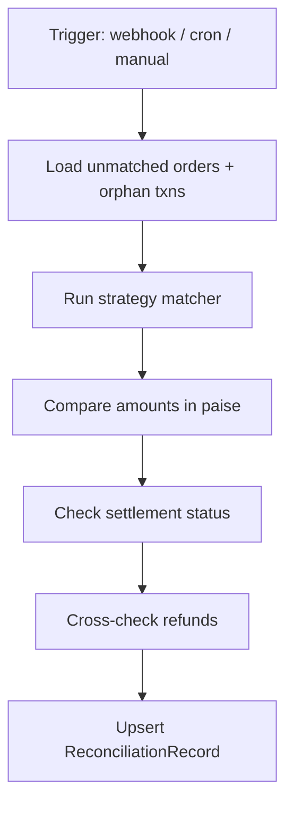
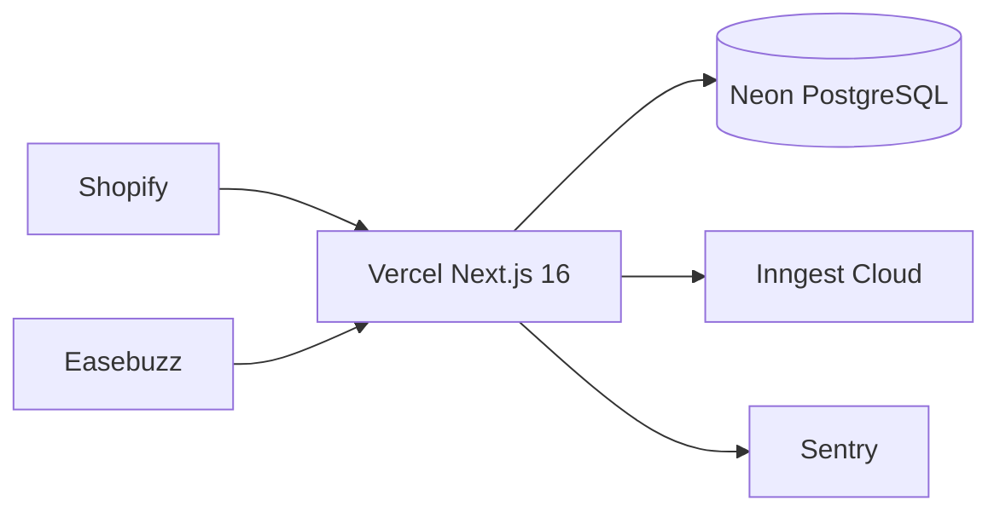

# SettleFlow — Backend Plan

> **CURSOR RULES — READ FIRST**
>
> ```text
> Never change architecture unless I explicitly approve.
> Never rename folders.
> Never replace libraries.
> Never rewrite existing code unless fixing a bug.
> Always extend the current architecture.
> If unsure, ask instead of assuming.
> ```

**Role:** Principal Backend Engineer  
**Build order:** Backend first → Frontend second  
**Product:** Shopify Payment Analytics & Settlement Reconciliation SaaS  
**Stack:** Next.js 16 Route Handlers · TypeScript · Prisma · PostgreSQL (Neon) · Shopify Admin GraphQL · Easebuzz APIs · Inngest · Zod

---

## Pinned Versions

Lock these in `package.json` `engines`, `.nvmrc`, and `pnpm-lock.yaml` / `package-lock.json`. Do not downgrade or swap without explicit approval.

| Package | Version |
|---------|---------|
| Node.js | **24** |
| Next.js | **16** |
| React | **19** |
| Prisma | **latest stable** |
| TypeScript | **latest stable** |
| Tailwind CSS | **v4** |
| shadcn/ui | **latest** |
| Inngest | **latest stable** |
| Vitest | **latest stable** |
| Playwright | **latest stable** |

---

## Non-Negotiable Decisions

These are locked before B0. Cursor must not change them.

- Next.js App Router only
- TypeScript strict mode (`"strict": true`)
- PostgreSQL on Neon — **never MongoDB or other document DBs**
- Prisma ORM only — **never Drizzle, TypeORM, Kysely, or raw SQL ORMs**
- Inngest for all background jobs — **never Bull, BullMQ, or custom cron-only workers**
- Shopify Admin **GraphQL API only** — no REST unless Shopify does not support the operation in GraphQL
- Server Components by default; Client Components only when interactivity requires it
- Route Handlers for all API endpoints
- Zod validation on every API input and env var
- Pino for structured logging — **never console.log in production code**
- Tailwind CSS v4 only — **never Bootstrap, MUI, Chakra, or other CSS frameworks on backend-adjacent code**

### Database Choice (Locked)

Keep **PostgreSQL + Prisma**. Do not switch to MongoDB.

Reconciliation, settlements, joins, reports, and analytics require relational SQL. This is the correct choice for a FinTech reconciliation product.

---

## Coding Rules

Apply to every file Cursor generates.

- Max file length: **300 lines** — split into smaller modules if exceeded
- Max function length: **40 lines** — extract helpers
- One responsibility per file
- No duplicate code — extract shared utilities
- No `any` type — use `unknown` + narrowing when needed
- No commented-out code
- Use `async/await` only — no raw `.then()` chains
- Prefer composition over inheritance
- Every **public** function needs JSDoc (`@param`, `@returns`, `@throws` where relevant)
- Every feature needs explicit TypeScript types (no implicit `any` from untyped imports)

---

## Testing

| Tool | Purpose |
|------|---------|
| **Vitest** | Unit tests (services, reconciliation strategies, hash/HMAC utils) |
| **Playwright** | API/integration tests (webhook routes, auth flows, pagination) |
| **MSW** | Mock Shopify/Easebuzz external APIs in tests |

### Test Folder Structure

```
tests/
├── unit/
│   ├── services/
│   ├── reconciliation/
│   └── easebuzz/
├── integration/
│   └── api/
└── setup/
    ├── vitest.setup.ts
    └── msw-handlers.ts
e2e/
└── api/                          # Playwright API tests
```

### Milestone Exit Criteria (Every Milestone)

Every milestone B0–B8 must end with:

```
1. Write tests for new code
2. Run tests (pnpm test)
3. Fix failing tests
```

Do not mark a milestone complete until all three steps pass.

---

## API Documentation

Auto-generate OpenAPI 3.1 spec from Zod schemas so the frontend team has a stable contract.

| Tool | Role |
|------|------|
| `@asteasolutions/zod-to-openapi` | Generate OpenAPI from Zod schemas |
| `swagger-ui-react` or Scalar | Serve interactive docs at `/api/docs` (dev + staging only) |

### Rules

- Every Route Handler input/output schema lives in `src/schemas/` as Zod
- OpenAPI spec regenerates on build (`pnpm openapi:generate`)
- Frontend types can be derived from the same Zod schemas
- Hide `/api/docs` in production (env-gated)

---

## Monitoring & Observability

| Tool | Purpose | When |
|------|---------|------|
| **Sentry** | Error tracking (API routes + Inngest functions) | B8 production |
| **Better Stack Logs** | Structured log aggregation (Pino → Better Stack) | B8 production |
| **PostHog** | Product analytics (onboarding funnel, reconcile triggers) | B8 production |

### Logging Standard (Pino)

Every request log includes: `requestId`, `shopId` (if known), `route`, `durationMs`, `statusCode`

---

## Environment Strategy

Keep dev and production fully isolated. Never point local dev at production DB or live payment keys.

| | Development | Production |
|---|-------------|------------|
| **Shopify** | Dev store + Shopify CLI tunnel | Live App Store app |
| **Easebuzz** | Sandbox keys + test webhooks | Live merchant keys |
| **Database** | Neon dev branch (`settleflow-dev`) | Neon main branch (`settleflow-prod`) |
| **Inngest** | Dev environment | Production environment |
| **Sentry** | Disabled or dev project | Production project |
| **API docs** | Enabled at `/api/docs` | Disabled |

### Env Files

```
.env.local          # Local dev (gitignored)
.env.example        # Template (committed)
.env.test           # Vitest/Playwright (committed, no secrets)
```

Vercel: separate env vars per `development`, `preview`, `production`.

---

## CI/CD (GitHub Actions)

Added in **B0** as workflow skeleton; fully wired by **B8**.

### Pipeline (`.github/workflows/ci.yml`)

```yaml
# Runs on every push + PR to main
jobs:
  ci:
    steps:
      - Checkout
      - Setup Node 24
      - Install dependencies
      - Lint (eslint)
      - Typecheck (tsc --noEmit)
      - Prisma Generate
      - Unit + Integration Tests (Vitest)
      - Build (next build)
      # Migrate runs only on deploy to production (B8)
```

| Step | Tool |
|------|------|
| Lint | ESLint |
| Typecheck | `tsc --noEmit` |
| Tests | Vitest |
| Build | `next build` |
| Prisma Generate | `prisma generate` |
| Prisma Migrate | `prisma migrate deploy` (production deploy only) |

---

## Product Architecture Decisions (Locked)

| Decision | Choice | Why |
|----------|--------|-----|
| Order matching | Configurable composite strategy per shop | Merchants integrate differently (`udf1`, `txnid`, payment IDs) |
| Dashboard auth | Hybrid — Shopify token exchange + standalone finance login | Merchants in Admin; accountants outside Shopify |
| Webhook processing | Persist → 200 OK → Inngest async | Easebuzz requires 200 within 10s; retries handled by Inngest |
| Money storage | Integer paise in DB | No floating-point reconciliation bugs |
| Multi-tenancy | `shopId` on every query | Simple, auditable, scales |
| Service layer | Thin routes → focused services | One file, one responsibility; easy to read |

---

## System Architecture



**Simple mental model:**
1. **Routes** = front door (auth check, validate input, call service, return JSON)
2. **Services** = business logic (one domain per file)
3. **Inngest** = slow/async work (webhooks, sync, reconciliation)
4. **Prisma** = database access only (no business logic in routes)

---

## Backend Folder Structure

```
src/
├── app/api/
│   ├── auth/
│   │   ├── shopify/route.ts
│   │   ├── login/route.ts
│   │   ├── logout/route.ts
│   │   └── invite/accept/route.ts
│   ├── webhooks/
│   │   ├── shopify/route.ts
│   │   └── easebuzz/
│   │       ├── transaction/route.ts
│   │       ├── payout/route.ts
│   │       └── refund/route.ts
│   ├── inngest/route.ts
│   ├── health/route.ts
│   └── shops/
│       ├── route.ts
│       └── [shopId]/
│           ├── payments/route.ts
│           ├── settlements/route.ts
│           ├── reconciliation/route.ts
│           ├── refunds/route.ts
│           ├── analytics/route.ts
│           ├── reconcile/route.ts
│           └── settings/
│               ├── route.ts
│               └── invite/route.ts
├── lib/
│   ├── db.ts
│   ├── env.ts
│   ├── logger.ts
│   ├── crypto/
│   │   └── encrypt.ts
│   ├── auth/
│   │   ├── shopify.ts
│   │   ├── standalone.ts
│   │   ├── rbac.ts
│   │   └── require-shop-access.ts
│   ├── shopify/
│   │   ├── client.ts
│   │   ├── webhooks.ts
│   │   ├── register-webhooks.ts
│   │   └── queries/
│   ├── easebuzz/
│   │   ├── client.ts
│   │   ├── webhooks.ts
│   │   ├── hash.ts
│   │   └── types.ts
│   ├── services/
│   │   ├── webhook.service.ts
│   │   ├── shop.service.ts
│   │   ├── order.service.ts
│   │   ├── transaction.service.ts
│   │   ├── settlement.service.ts
│   │   ├── refund.service.ts
│   │   ├── reconciliation.service.ts
│   │   ├── analytics.service.ts
│   │   └── onboarding.service.ts
│   ├── reconciliation/
│   │   ├── engine.ts
│   │   ├── rules.ts
│   │   └── strategies/
│   │       ├── index.ts
│   │       ├── udf-order-id.ts
│   │       ├── udf-order-name.ts
│   │       ├── txnid-order-name.ts
│   │       ├── shopify-payment-id.ts
│   │       └── composite.ts
│   ├── inngest/
│   │   ├── client.ts
│   │   └── functions/
│   │       ├── process-shopify-webhook.ts
│   │       ├── process-easebuzz-webhook.ts
│   │       ├── sync-shopify-orders.ts
│   │       ├── poll-easebuzz-settlements.ts
│   │       └── run-reconciliation.ts
│   └── api/
│       ├── response.ts
│       ├── errors.ts
│       └── pagination.ts
├── schemas/                          # Zod schemas (shared with frontend + OpenAPI)
│   ├── auth.schema.ts
│   ├── settings.schema.ts
│   ├── payments.schema.ts
│   └── analytics.schema.ts
└── types/
    └── api.ts
tests/
├── unit/
├── integration/
└── setup/
e2e/api/
openapi/
└── spec.json                       # Auto-generated — do not hand-edit
.github/workflows/
└── ci.yml
.nvmrc                              # 24
prisma/
├── schema.prisma
├── migrations/
└── seed.ts
shopify.app.toml
.env.example
.env.test
```

---

## Database Schema

### ERD



### Prisma Models (field reference)

**Shop**
- `id` cuid, `shopDomain` unique, `shopName`, `currency`, `timezone`
- `isActive`, `installedAt`, `uninstalledAt`, `onboardingStep`
- `planTier` (future)

**ShopifySession**
- `shopId` unique, `accessToken` encrypted, `scope`, `expiresAt` nullable

**User**
- `id`, `email` unique, `passwordHash`, `name`, `createdAt`

**ShopMember**
- `shopId`, `userId`, `role` enum: OWNER | ADMIN | VIEWER
- `inviteToken`, `invitedAt`, `acceptedAt`
- unique(`shopId`, `userId`)

**PaymentGateway**
- `shopId`, `provider` enum: EASEBUZZ
- `key` encrypted, `salt` encrypted, `merchantEmail`
- `environment` enum: SANDBOX | PRODUCTION, `isActive`

**MatchingConfig**
- `shopId` unique
- `strategy` enum: UDF_ORDER_ID | UDF_ORDER_NAME | TXNID_ORDER_NAME | SHOPIFY_PAYMENT_ID | COMPOSITE
- `priority` Json (string[] for COMPOSITE)
- `fieldMapping` Json
- `amountTolerancePaise` Int default 0
- `includeGatewayFees` Boolean default false

**ShopifyOrder**
- `shopId`, `shopifyOrderId` unique per shop, `orderName`, `orderNumber`
- `totalPricePaise` Int, `currency`, `financialStatus`
- `paymentGatewayNames` String[], `shopifyPaymentId` nullable
- `processedAt`, `rawPayload` Json

**GatewayTransaction**
- `shopId`, `gatewayId`, `easebuzzTxnId`, `easebuzzPaymentId`
- `amountPaise`, `feesPaise`, `netAmountPaise`, `currency`
- `status`, `mode`, `email`, `phone`
- `udf1`–`udf10`, `txnid`
- `matchedOrderId` nullable FK
- `settlementStatus` enum: PENDING | SETTLED | UNSETTLED
- `occurredAt`, `rawPayload` Json
- unique(`shopId`, `easebuzzTxnId`)

**GatewaySettlement**
- `shopId`, `gatewayId`, `payoutId` unique per shop
- `payoutDate`, `totalAmountPaise`, `transactionCount`
- `status`, `utrNumber`, `bankAccountLast4`, `rawPayload` Json

**SettlementLineItem**
- `settlementId`, `transactionId`, `grossPaise`, `feesPaise`, `netPaise`

**GatewayRefund**
- `shopId`, `transactionId`, `refundId` unique per shop
- `amountPaise`, `status`, `shopifyRefundId` nullable
- `processedAt`, `rawPayload` Json

**ReconciliationRecord**
- `shopId`, `shopifyOrderId` nullable, `transactionId` nullable
- `status` enum: MATCHED | AMOUNT_MISMATCH | MISSING_GATEWAY | MISSING_SHOPIFY | PENDING_SETTLEMENT | REFUND_MISMATCH | RESOLVED
- `expectedAmountPaise`, `actualAmountPaise`, `deltaPaise`, `reason`
- `resolvedAt`, `resolvedByUserId` nullable

**WebhookEvent**
- `source` enum: SHOPIFY | EASEBUZZ
- `eventType`, `idempotencyKey` unique, `shopId` nullable
- `payload` Json, `status` enum: RECEIVED | PROCESSING | PROCESSED | FAILED
- `processedAt`, `error` nullable

### Critical Indexes
- `GatewayTransaction(shopId, occurredAt DESC)`
- `GatewaySettlement(shopId, payoutDate DESC)`
- `ReconciliationRecord(shopId, status)`
- `ShopifyOrder(shopId, orderName)`
- `WebhookEvent(idempotencyKey)` unique

---

## API Routes (Complete Contract)

### Standard Response Envelope

```typescript
// Success
{ success: true, data: T, meta?: { page: number; pageSize: number; total: number; hasMore: boolean } }

// Error
{ success: false, error: { code: string; message: string; details?: unknown } }
```

### Auth

| Method | Route | Auth | Purpose |
|--------|-------|------|---------|
| POST | `/api/auth/shopify` | Session token JWT | Token exchange → store offline token |
| POST | `/api/auth/login` | Public | Standalone finance login |
| POST | `/api/auth/logout` | Cookie | Clear session |
| POST | `/api/auth/invite/accept` | Invite token | Accept team invite |

### Webhooks (public, verified)

| Method | Route | Verification |
|--------|-------|--------------|
| POST | `/api/webhooks/shopify` | HMAC-SHA256 raw body |
| POST | `/api/webhooks/easebuzz/transaction` | Easebuzz hash |
| POST | `/api/webhooks/easebuzz/payout` | Easebuzz hash |
| POST | `/api/webhooks/easebuzz/refund` | Easebuzz hash |

### Dashboard (authenticated + shop scoped)

| Method | Route | RBAC | Purpose |
|--------|-------|------|---------|
| GET | `/api/shops` | Any member | List shops for current user |
| GET | `/api/shops/[shopId]/payments` | VIEWER+ | Paginated transactions |
| GET | `/api/shops/[shopId]/settlements` | VIEWER+ | Settlement batches |
| GET | `/api/shops/[shopId]/reconciliation` | VIEWER+ | Mismatch records |
| PATCH | `/api/shops/[shopId]/reconciliation/[id]` | ADMIN+ | Mark resolved |
| GET | `/api/shops/[shopId]/refunds` | VIEWER+ | Refund list |
| GET | `/api/shops/[shopId]/analytics` | VIEWER+ | KPIs + chart series |
| POST | `/api/shops/[shopId]/reconcile` | ADMIN+ | Manual reconciliation trigger |
| GET | `/api/shops/[shopId]/settings` | VIEWER+ | Read config (secrets masked) |
| PATCH | `/api/shops/[shopId]/settings` | ADMIN+ | Update gateway + matching |
| POST | `/api/shops/[shopId]/settings/invite` | ADMIN+ | Invite team member |
| GET | `/api/health` | Public | Liveness |
| GET/POST | `/api/inngest` | Inngest signing | Job runner |

### Query Params (pagination + filters)

All list endpoints support:
- `page` (default 1), `pageSize` (default 25, max 100)
- `from`, `to` (ISO date)
- `status`, `search` (endpoint-specific)
- `sortBy`, `sortOrder` (asc | desc)

---

## Webhook Flow



### Idempotency Keys
- **Shopify:** `shopify:{X-Shopify-Webhook-Id}`
- **Easebuzz transaction:** `easebuzz:txn:{txnid}:{status}`
- **Easebuzz payout:** `easebuzz:payout:{payoutId}`
- **Easebuzz refund:** `easebuzz:refund:{refundId}:{status}`

### Easebuzz Route Rules
- Parse `application/x-www-form-urlencoded` via `URLSearchParams`
- Verify hash before DB write
- Resolve `shopId` from merchant key in payload → lookup `PaymentGateway`
- Return plain `200` with empty body

### Shopify Subscriptions
- `orders/paid`, `orders/updated`, `refunds/create`, `app/uninstalled`

---

## Authentication Flow

### Embedded (Shopify Admin)



**Why token exchange:** 2026 best practice — no OAuth redirects inside iframe.

### Standalone (Finance Portal)



### RBAC Matrix

| Action | OWNER | ADMIN | VIEWER |
|--------|-------|-------|--------|
| Read dashboard data | ✓ | ✓ | ✓ |
| Update settings | ✓ | ✓ | ✗ |
| Invite team | ✓ | ✓ | ✗ |
| Trigger reconcile | ✓ | ✓ | ✗ |
| Resolve mismatches | ✓ | ✓ | ✗ |

---

## Shopify Installation Flow



**Scopes:** `read_orders`, `read_all_orders`  
**Config:** `shopify.app.toml` with `use_legacy_install_flow = false`  
**Uninstall:** `app/uninstalled` → deactivate shop, delete access token, retain historical data

---

## Easebuzz Integration Flow

### Onboarding (backend-only steps)
1. `PATCH /settings` saves encrypted key/salt/email/environment
2. `EasebuzzService.validateCredentials()` calls Transaction Date API (1 day)
3. Return webhook URLs + masked credential status
4. On first verified webhook → set `onboardingStep = COMPLETE`

### Webhook URLs (merchant copies to Easebuzz dashboard)
- `/api/webhooks/easebuzz/transaction`
- `/api/webhooks/easebuzz/payout`
- `/api/webhooks/easebuzz/refund`

### Fallback Polling (Inngest cron — daily 2am IST)
- Payout API for yesterday's settlements
- Transaction Date API for gap fill
- Only for shops with active Easebuzz gateway

### Credential Security
- AES-256-GCM encryption with `ENCRYPTION_KEY`
- Never return raw key/salt in API — mask as `key_****abcd`

---

## Reconciliation Engine

### Strategies (configurable per shop)

| Strategy | Match Logic |
|----------|-------------|
| `UDF_ORDER_ID` | `gateway.udf1` = Shopify numeric order ID |
| `UDF_ORDER_NAME` | `gateway.udf1` = `#1001` |
| `TXNID_ORDER_NAME` | `gateway.txnid` = order name |
| `SHOPIFY_PAYMENT_ID` | mapped udf field = Shopify payment GID |
| `COMPOSITE` | Try priority list until match found |

### Pipeline



### Statuses
- `MATCHED` — order + transaction aligned
- `PENDING_SETTLEMENT` — matched, not yet paid out
- `AMOUNT_MISMATCH` — reference matched, amounts differ
- `MISSING_GATEWAY` — Shopify paid, no gateway txn
- `MISSING_SHOPIFY` — gateway txn, no Shopify order
- `REFUND_MISMATCH` — refund totals don't align
- `RESOLVED` — manually closed by admin

### Amount Rules
- All math in **paise** (Int)
- `deltaPaise <= amountTolerancePaise` → treat as MATCHED
- `includeGatewayFees` subtracts fees from comparison when enabled

### Triggers
- Event-driven after every processed webhook
- Nightly cron per active shop
- Manual via `POST /api/shops/[shopId]/reconcile`

---

## Service Layer Design

Each service is a plain object or class with short methods. No ORM calls in routes.

| Service | Responsibility |
|---------|----------------|
| `WebhookService` | Idempotency, enqueue, route to processor |
| `ShopService` | Shop CRUD, install/uninstall |
| `OrderService` | Upsert Shopify orders from webhook/sync |
| `TransactionService` | Upsert Easebuzz transactions |
| `SettlementService` | Upsert payouts + line items |
| `RefundService` | Upsert refunds |
| `ReconciliationService` | Run engine, resolve records |
| `AnalyticsService` | Aggregate KPIs + chart data |
| `OnboardingService` | Track/setup onboarding steps |

**Example route pattern (pseudocode — not generated code):**
```
route.ts → validate(Zod) → requireShopAccess → Service.method → jsonResponse
```

---

## Error Handling

### Error Hierarchy
```
AppError
├── ValidationError (400)
├── AuthError (401)
├── ForbiddenError (403)
├── NotFoundError (404)
├── WebhookVerificationError (401)
├── ExternalAPIError (502)
└── ReconciliationError (422)
```

### Rules by Layer
| Layer | Rule |
|-------|------|
| Routes | try/catch → map to envelope → never leak stack traces |
| Webhooks | Always 200 after persist; failures retried by Inngest |
| Inngest | 3 retries, exponential backoff; write error to WebhookEvent |
| External APIs | Wrap in ExternalAPIError with provider name |

### Logging (Pino)
Every log includes: `requestId`, `shopId` (if known), `eventType`, `durationMs`

---

## Security Checklist

- [ ] Verify Shopify HMAC on every webhook (raw body)
- [ ] Verify Easebuzz hash on every webhook
- [ ] Verify session token JWT on embedded API calls
- [ ] bcrypt (cost 12) for standalone passwords
- [ ] httpOnly, secure, sameSite cookies
- [ ] Every DB query filtered by `shopId`
- [ ] RBAC on mutating routes
- [ ] Zod validation on all inputs
- [ ] Encrypt gateway secrets at rest
- [ ] Rate limit auth routes
- [ ] Audit log for settings changes + mismatch resolutions

---

## Deployment



**Env vars:** `DATABASE_URL`, `SHOPIFY_API_KEY`, `SHOPIFY_API_SECRET`, `SCOPES`, `HOST`, `ENCRYPTION_KEY`, `INNGEST_EVENT_KEY`, `INNGEST_SIGNING_KEY`, `SESSION_SECRET`, `SENTRY_DSN`

**Neon:** Use pooler URL + branch per preview environment  
**Migrations:** `prisma migrate deploy` on Vercel build hook

---

## Future Scalability

| Phase | Enhancement |
|-------|-------------|
| v2 | `PaymentGatewayAdapter` interface — Razorpay, PayU, Cashfree |
| v2 | Daily rollup table for analytics (materialized) |
| v3 | Per-shop Inngest concurrency keys |
| v3 | Neon read replica for analytics queries |
| v4 | Webhook event archival to cold storage |

---

## Backend Milestones

**Stop after each milestone. Wait for approval before continuing.**

**Every milestone exit:** Write tests → Run tests → Fix failing tests

---

### B0 — Project + Env Foundation
- Next.js 16 scaffold (API-only focus; minimal page shell)
- Pin Node 24 (`.nvmrc` + `engines`), TypeScript strict mode
- Zod env validation, Pino logger, error classes, response helpers
- Vitest + MSW + Playwright scaffold
- GitHub Actions CI (lint, typecheck, test, build, prisma generate)
- OpenAPI generator script stub (`pnpm openapi:generate`)
- **Deliverable:** `/api/health` returns 200; CI passes on empty test suite

### B1 — Database
- Neon dev branch + Prisma full schema + migration + seed
- Unit tests for Prisma seed data integrity
- **Deliverable:** Prisma Studio shows all tables with sample shop; CI green

### B2 — Shopify Auth + Install
- `shopify.app.toml`, token exchange, Shop/Session upsert
- Vitest tests for JWT verification; Playwright test for auth route
- **Deliverable:** Dev store install creates shop row + offline token; tests pass

### B3 — Shopify Webhooks + Order Sync
- Webhook HMAC verify, idempotency, Inngest processor
- GraphQL order sync job (initial + incremental)
- MSW mocks for Shopify GraphQL; integration tests for webhook route
- **Deliverable:** Test order appears in `ShopifyOrder` table; tests pass

### B4 — Standalone Auth + RBAC
- User/ShopMember, login/logout/invite
- `requireShopAccess` middleware helper
- Tests for RBAC matrix (OWNER/ADMIN/VIEWER)
- **Deliverable:** Finance user can authenticate; API enforces roles; tests pass

### B5 — Easebuzz Integration
- Encrypted credential storage, API client, validate endpoint
- Settings PATCH/GET (secrets masked)
- MSW mocks for Easebuzz API; unit tests for encryption round-trip
- OpenAPI docs updated for settings routes
- **Deliverable:** Credentials saved and validated against Easebuzz sandbox; tests pass

### B6 — Easebuzz Webhooks
- Transaction, payout, refund routes + hash verify + processors
- Unit tests for hash verification; integration tests for all 3 webhook routes
- **Deliverable:** Test webhook creates gateway records in DB; tests pass

### B7 — Reconciliation Engine
- All 5 strategies, amount rules, event + cron + manual triggers
- Reconciliation + analytics API routes
- Comprehensive unit tests per strategy + amount tolerance edge cases
- OpenAPI spec complete for all dashboard APIs
- **Deliverable:** API returns mismatches, KPIs, paginated data; `/api/docs` live in dev — **frontend can begin**

### B8 — Production Hardening + Deploy
- Sentry, Better Stack Logs, PostHog wired
- Rate limits, security audit
- CI: add `prisma migrate deploy` on production deploy
- Vercel production deploy (Neon prod branch, live env vars)
- **Deliverable:** Production backend live; monitoring active; CI/CD complete

---

## Cursor Backend Prompt (copy-paste for each milestone)

```text
You are a Principal Backend Engineer.

CURSOR RULES (NON-NEGOTIABLE):
- Never change architecture unless I explicitly approve.
- Never rename folders.
- Never replace libraries.
- Never rewrite existing code unless fixing a bug.
- Always extend the current architecture.
- If unsure, ask instead of assuming.

Follow docs/backend-plan.md exactly. Implement ONLY the current milestone (ask which one if unclear).

Pinned: Node 24, Next 16, React 19, Prisma latest, Tailwind v4, Vitest, Playwright.

Stack (locked): Next.js App Router, TypeScript strict, Prisma, PostgreSQL (Neon), Inngest, Zod, Pino, Shopify GraphQL only.

Coding rules: max 300 lines/file, max 40 lines/function, no any, no commented code, JSDoc on public functions, async/await only.

Rules:
- Routes are thin. Business logic lives in lib/services/.
- Secure webhook verification. Idempotent processing.
- Every DB query scoped by shopId. Integer paise for money.
- Do NOT build frontend UI. Do NOT use MongoDB or non-Prisma ORMs.
- Milestone exit: Write tests → Run tests → Fix failing tests.
- Stop when deliverable is met. Wait for approval.
```

---

**Next step:** Plans are locked. Begin **B0 → B8** without adding more documentation.
